# TechMeAnything - System Architecture Diagram

## Comprehensive System Flow with Tool Integrations

```mermaid
graph TB
    %% User Interface
    UI[👤 User Interface<br/>React/Web App]
    
    %% Main Application
    API[🚀 FastAPI Backend<br/>TechMeAnything Core]
    
    %% User Onboarding Flow
    subgraph "🎯 User Onboarding"
        ONBOARD[UserOnboardingService<br/>📝 Name, Language, Learning Style]
        ONBOARD --> MEM0_PREFS[Store Preferences]
    end
    
    %% Mem0 Integration
    subgraph "🧠 Mem0 Platform"
        MEM0[Mem0Service<br/>🔑 User Preferences<br/>📊 Learning Analytics]
        MEM0_LOGO[<img src='https://mem0.ai/logo.png' width='50' height='50'/>]
        MEM0 --> MEM0_LOGO
    end
    
    %% OpenAI Integration
    subgraph "🤖 OpenAI Services"
        OPENAI_LLM[OpenAI GPT-4<br/>💬 Chat Responses<br/>📝 Quiz Generation]
        OPENAI_SORA[OpenAI Sora 2<br/>🎬 Video Generation]
        OPENAI_LOGO[<img src='https://openai.com/favicon.ico' width='50' height='50'/>]
        OPENAI_LLM --> OPENAI_LOGO
        OPENAI_SORA --> OPENAI_LOGO
    end
    
    %% ElevenLabs Integration
    subgraph "🎵 ElevenLabs"
        ELEVENLABS_TTS[ElevenLabs TTS<br/>🔊 Audio Responses]
        ELEVENLABS_AUDIOBOOK[ElevenLabs Audiobook<br/>📚 PDF to Audio]
        ELEVENLABS_LOGO[<img src='https://elevenlabs.io/favicon.ico' width='50' height='50'/>]
        ELEVENLABS_TTS --> ELEVENLABS_LOGO
        ELEVENLABS_AUDIOBOOK --> ELEVENLABS_LOGO
    end
    
    %% Supabase Integration
    subgraph "🗄️ Supabase Database"
        SUPABASE_CHAT[User Learning History<br/>💭 Chat Context]
        SUPABASE_MATERIALS[Study Materials<br/>📚 Knowledge Graph]
        SUPABASE_RECOMMENDATIONS[Recommendations<br/>🎯 Smart Suggestions]
        SUPABASE_LOGO[<img src='https://supabase.com/favicon.ico' width='50' height='50'/>]
        SUPABASE_CHAT --> SUPABASE_LOGO
        SUPABASE_MATERIALS --> SUPABASE_LOGO
        SUPABASE_RECOMMENDATIONS --> SUPABASE_LOGO
    end
    
    %% Smithery MCP Integration
    subgraph "⚡ Smithery MCP"
        SMITHERY[Supabase MCP Server<br/>🔧 Database Management]
        SMITHERY_LOGO[<img src='https://smithery.ai/favicon.ico' width='50' height='50'/>]
        SMITHERY --> SMITHERY_LOGO
    end
    
    %% PDF Processing
    subgraph "📄 PDF Processing"
        PDF_SERVICE[PDFService<br/>📖 Text Extraction]
        PDF_UPLOAD[File Upload<br/>📎 PDF Attachments]
    end
    
    %% Main Flow Connections
    UI -->|1. User Message| API
    API -->|2. Check Preferences| MEM0
    API -->|3. Get Chat History| SUPABASE_CHAT
    API -->|4. Check Materials| SUPABASE_MATERIALS
    
    %% Response Generation Flow
    API -->|5a. Generate Response| OPENAI_LLM
    API -->|5b. Generate Video| OPENAI_SORA
    API -->|5c. Generate Audio| ELEVENLABS_TTS
    API -->|5d. Generate Audiobook| ELEVENLABS_AUDIOBOOK
    
    %% Data Storage Flow
    API -->|6. Store Preferences| MEM0
    API -->|7. Store Chat History| SUPABASE_CHAT
    API -->|8. Store Materials| SUPABASE_MATERIALS
    API -->|9. Manage Database| SMITHERY
    
    %% PDF Processing Flow
    UI -->|Upload PDF| PDF_UPLOAD
    PDF_UPLOAD -->|Extract Text| PDF_SERVICE
    PDF_SERVICE -->|Generate Audiobook| ELEVENLABS_AUDIOBOOK
    
    %% Onboarding Flow
    API -->|New User| ONBOARD
    ONBOARD -->|Store Preferences| MEM0_PREFS
    
    %% Response Back to User
    OPENAI_LLM -->|Text Response| API
    OPENAI_SORA -->|Video URL| API
    ELEVENLABS_TTS -->|Audio URL| API
    ELEVENLABS_AUDIOBOOK -->|Audio Chunks| API
    API -->|Complete Response| UI
    
    %% Styling
    classDef userInterface fill:#e1f5fe,stroke:#01579b,stroke-width:3px,color:#000
    classDef mem0Service fill:#f3e5f5,stroke:#4a148c,stroke-width:3px,color:#000
    classDef openaiService fill:#e8f5e8,stroke:#1b5e20,stroke-width:3px,color:#000
    classDef elevenlabsService fill:#fff3e0,stroke:#e65100,stroke-width:3px,color:#000
    classDef supabaseService fill:#e3f2fd,stroke:#0d47a1,stroke-width:3px,color:#000
    classDef smitheryService fill:#fce4ec,stroke:#880e4f,stroke-width:3px,color:#000
    classDef pdfService fill:#f1f8e9,stroke:#33691e,stroke-width:3px,color:#000
    classDef onboardingService fill:#fff8e1,stroke:#ff6f00,stroke-width:3px,color:#000
    
    class UI userInterface
    class MEM0,MEM0_PREFS mem0Service
    class OPENAI_LLM,OPENAI_SORA openaiService
    class ELEVENLABS_TTS,ELEVENLABS_AUDIOBOOK elevenlabsService
    class SUPABASE_CHAT,SUPABASE_MATERIALS,SUPABASE_RECOMMENDATIONS supabaseService
    class SMITHERY smitheryService
    class PDF_SERVICE,PDF_UPLOAD pdfService
    class ONBOARD onboardingService
```

## Key Features Showcased:

### 🧠 **Mem0 Integration**
- **User Preferences Storage**: Name, language, learning style, grade level
- **Learning Analytics**: Tracks user behavior and preferences
- **Personalization Engine**: Powers adaptive responses

### 🤖 **OpenAI Services**
- **GPT-4 Chat Responses**: Intelligent, contextual conversations
- **Sora 2 Video Generation**: Educational video content creation
- **Quiz Generation**: Interactive learning assessments

### 🎵 **ElevenLabs Integration**
- **Text-to-Speech**: Natural voice responses
- **Audiobook Generation**: PDF to audio conversion
- **Multi-language Support**: Global accessibility

### 🗄️ **Supabase Database**
- **Chat History**: Context-aware conversations
- **Knowledge Graph**: Study materials and recommendations
- **Real-time Updates**: Live data synchronization

### ⚡ **Smithery MCP**
- **Database Management**: Automated schema operations
- **API Orchestration**: Seamless service integration
- **Infrastructure Control**: Simplified deployment

### 📄 **PDF Processing**
- **Text Extraction**: Clean, readable content
- **Audiobook Creation**: Educational content accessibility
- **File Management**: Secure upload and storage

### 🎯 **User Onboarding**
- **Conversational Flow**: Natural preference collection
- **Progressive Profiling**: Step-by-step user setup
- **Personalization**: Tailored learning experience

## Data Flow Summary:

1. **User Input** → FastAPI Backend
2. **Preference Check** → Mem0 Platform
3. **Context Retrieval** → Supabase Database
4. **Response Generation** → OpenAI Services
5. **Media Creation** → ElevenLabs & Sora
6. **Data Storage** → Mem0 & Supabase
7. **Response Delivery** → User Interface

This architecture demonstrates a comprehensive educational platform that leverages cutting-edge AI services to provide personalized, multi-modal learning experiences.
